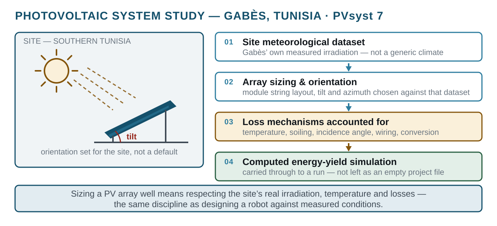

# Photovoltaic System Design — Gabès
> A solar PV installation sized and simulated in PVsyst against the real irradiation of a site in southern Tunisia.
`2025` · `PVsyst 7` · `Solar PV` · `Energy yield` · `Simulation` · `Meteo data`



## About

A full photovoltaic system study built in PVsyst 7 for a site in Gabès, Tunisia, using that location's own meteorological dataset rather than a generic climate. The design was carried through to a computed simulation run — array sizing, orientation and an energy-yield estimate — not left as an empty project file.

Solar is a natural fit for the region and a deliberate complement to the rest of this portfolio: the same discipline of designing against measured conditions, applied to energy systems instead of robots. Sizing a PV array well means respecting the site's real irradiation, temperature and loss mechanisms — which is exactly what a proper simulation forces you to account for.

## Contents

```
docs/
```

## Notes

DOCUMENTATION ONLY - the deliverable is a PVsyst study; the local folder holds only the PVsyst installer, which is vendor software and is not redistributable.

## Third-party work used here

Everything in this repository is my own work. It builds on the following, which are **not** mine and are used under their own licences:

- **PVsyst** by PVsyst SA — <https://pvsyst.com>

## Author

Lassaad Mahmoudi — <contact@iris-systems.tn>  
https://linkedin.com/in/mahmoudiassaad
